div align="center">
  
</div>

<h1 align="center">Olá! Eu sou Mayko Fiel</h1>

<h3 align="center">Desenvolvedor Java Júnior | Back-End Developer | Engenharia de Software</h3>

<p align="center">
  
</p>

<div align="center">
  
  [](https://www.linkedin.com/in/maykofiel)
  [](mailto:maykofiel.dev@gmail.com)
  [](https://wa.me/5511980700428)
  
</div>

<br/>

## 🎯 Sobre Mim

```java
public class MaykoFiel {
    
    private String nome = "Mayko Fiel";
    private String localizacao = "Barrocas, Bahia, Brasil";
    private String foco = "Desenvolvimento Back-End";
    private String[] tecnologias = {"Java", "OOP", "Git", "JavaScript"};
    private String formacao = "Engenharia de Software";
    
    public String getObjetivo() {
        return "Busco minha primeira oportunidade como Desenvolvedor Java Júnior, "
             + "onde eu possa evoluir tecnicamente, contribuir com soluções bem "
             + "estruturadas e crescer em ambientes colaborativos.";
    }
    
    public void trabalharDuro() {
        while (true) {
            aprender();
            desenvolver();
            melhorar();
        }
    }
}
```

<table>
<tr>
<td width="50%">

💼 **Desenvolvedor Java Júnior** em formação com foco em **Back-End**

🎓 Cursando **Engenharia de Software** na Descomplica Faculdade Digital

</td>
<td width="50%">

📚 Aplicando conceitos sólidos de **POO**, **lógica de negócio** e **boas práticas**

🔍 Buscando primeira oportunidade profissional na área de desenvolvimento

</td>
</tr>
</table>

<br/>

## 🛠️ Stack Tecnológica

<div align="center">

### Core


### Ferramentas


### Em Desenvolvimento


</div>

<br/>

## 💼 Projetos em Destaque

<div align="center">

| 🏦 Sistema Bancário em Java |
|:---:|
| Aplicação bancária simulando operações reais do sistema financeiro |
| **Funcionalidades:** |
| ✅ Implementação de classes de domínio (Account, Bank, Log) |
| ✅ Aplicação de POO: Encapsulamento, Herança e Polimorfismo |
| ✅ Validação de saldo, depósito, saque e histórico de transações |
| ✅ Estruturação em pacotes seguindo boas práticas |
| ✅ Controle de versão com Git |
| **Stack:** `Java` `OOP` `Git` `Clean Code` |

</div>

<br/>

## 📊 GitHub Analytics

<div align="center">
  
  
</div>

<div align="center">
  
</div>

<div align="center">
  
</div>

<br/>

## 🎯 Competências

<table>
<tr>
<td width="50%" valign="top">

### Hard Skills
- ✅ Programação Orientada a Objetos (POO)
- ✅ Lógica de Programação e Algoritmos
- ✅ Estruturas de Dados
- ✅ Versionamento com Git/GitHub
- ✅ Análise de Processos
- ✅ Excel Avançado para Análise de Dados

</td>
<td width="50%" valign="top">

### Soft Skills
- ✅ Aprendizagem Contínua
- ✅ Planejamento e Organização
- ✅ Trabalho em Equipe
- ✅ Resolução de Problemas
- ✅ Comunicação Efetiva

</td>
</tr>
</table>

<br/>

## 🎓 Formação Acadêmica

<table>
<tr>
<td width="50%">

📚 **Bacharelado em Engenharia de Software**
<br/>*Descomplica Faculdade Digital*
<br/>2025 - 2029

</td>
<td width="50%">

📚 **Tecnólogo em Gestão de Cooperativas**
<br/>*Instituto Federal Baiano*
<br/>2021 - 2024

</td>
</tr>
</table>

### 📜 Certificações
<div align="center">


</div>

<br/>

## 📈 Roadmap de Aprendizado

```mermaid
%%{init: {'theme':'dark', 'themeVariables': { 'darkMode': true, 'primaryColor':'#00d9ff', 'primaryTextColor':'#c9d1d9', 'primaryBorderColor':'#30363d', 'lineColor':'#58a6ff', 'secondaryColor':'#161b22', 'tertiaryColor':'#0d1117'}}}%%
graph LR
    A[Fundamentos Java] --> B[POO Avançada]
    B --> C[Estruturas de Dados]
    C --> D[Spring Boot]
    D --> E[APIs REST]
    E --> F[Banco de Dados]
    F --> G[Microserviços]
    
    style A fill:#238636,stroke:#2ea043,color:#fff
    style B fill:#238636,stroke:#2ea043,color:#fff
    style C fill:#238636,stroke:#2ea043,color:#fff
    style D fill:#9e6a03,stroke:#d29922,color:#fff
    style E fill:#1f6feb,stroke:#58a6ff,color:#fff
    style F fill:#1f6feb,stroke:#58a6ff,color:#fff
    style G fill:#1f6feb,stroke:#58a6ff,color:#fff
```

<div align="center">



<table>
<tr>
<td align="center">🟢 <b>Concluído</b></td>
<td align="center">🟡 <b>Em Andamento</b></td>
<td align="center">🔵 <b>Próximos Passos</b></td>
</tr>
</table>

</div>

<br/>

## 💡 Foco Atual de Estudos

```java
// Tecnologias em desenvolvimento:
public class FocoAtual {
    
    private List<String> estudando = Arrays.asList(
        "Spring Framework & Spring Boot",
        "Desenvolvimento de APIs RESTful",
        "Banco de Dados Relacionais (PostgreSQL, MySQL)",
        "Testes Unitários (JUnit, Mockito)",
        "Padrões de Projeto (Design Patterns)",
        "Clean Architecture"
    );
    
    private String meta = "Construir aplicações escaláveis e bem arquitetadas";
}
```

<br/>

## 📫 Contato

<div align="center">

<table>
<tr>
<td align="center" width="33%">

📧 **Email**
<br/>[maykofiel.dev@gmail.com](mailto:maykofiel.dev@gmail.com)

</td>
<td align="center" width="33%">

💼 **LinkedIn**
<br/>[linkedin.com/in/maykofiel](https://www.linkedin.com/in/maykofiel)

</td>
<td align="center" width="33%">

📱 **WhatsApp**
<br/>[(11) 98070-0428](https://wa.me/5511980700428)

</td>
</tr>
<tr>
<td colspan="3" align="center">

📍 **Localização:** Barrocas, Bahia, Brasil

</td>
</tr>
</table>

</div>

<br/>

---

<div align="center">
  
### 💭 Filosofia de Código

*"Código limpo não é escrito seguindo regras. Você não se torna um artesão de software ao aprender uma lista de heurísticas. O profissionalismo e a arte de escrever código vêm da disciplina obtida através da prática."*

**— Robert C. Martin**
  
<br/>


  
⭐ **Se você gostou do meu trabalho, considere deixar uma estrela nos repositórios!**
  
</div>

  
  
