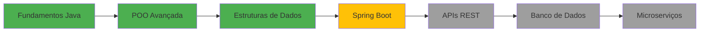

<div align="center">
  
</div>

<h1 align="center">👋 Olá! Eu sou Mayko Fiel</h1>

<h3 align="center">Desenvolvedor Java Júnior | Back-End Developer | Engenharia de Software</h3>

<p align="center">
  
</p>

<div align="center">
  
  [](https://www.linkedin.com/in/maykofiel)
  [](mailto:maykofiel.dev@gmail.com)
  [](https://wa.me/5511980700428)
  
</div>

---

## 🚀 Sobre Mim

```java
public class MaykoFiel {
    
    private String nome = "Mayko Fiel";
    private String localizacao = "Barrocas, Bahia, Brasil";
    private String foco = "Desenvolvimento Back-End";
    private String[] tecnologias = {"Java", "OOP", "Git", "JavaScript"};
    private String formacao = "Engenharia de Software";
    
    public String getObjetivo() {
        return "Busco minha primeira oportunidade como Desenvolvedor Java Júnior, "
             + "onde eu possa evoluir tecnicamente, contribuir com soluções bem "
             + "estruturadas e crescer em ambientes colaborativos.";
    }
    
    public void trabalharDuro() {
        while (true) {
            aprender();
            desenvolver();
            melhorar();
        }
    }
}
```

💼 **Desenvolvedor Java Júnior** em formação com foco em **Back-End**  
🎓 Cursando **Engenharia de Software** na Descomplica Faculdade Digital  
📚 Aplicando conceitos sólidos de **POO**, **lógica de negócio** e **boas práticas**  
🔍 Buscando primeira oportunidade profissional na área de desenvolvimento  

---

## 🛠️ Tecnologias & Ferramentas

<div align="center">

### Linguagens


### Ferramentas & Tecnologias


### Estudando


</div>

---

## 💼 Projetos em Destaque

### 🏦 Sistema Bancário em Java
**Descrição:** Aplicação bancária simulando operações reais do sistema financeiro
- ✅ Implementação de classes de domínio (Account, Bank, Log)
- ✅ Aplicação de POO: Encapsulamento, Herança e Polimorfismo
- ✅ Validação de saldo, depósito, saque e histórico de transações
- ✅ Estruturação em pacotes seguindo boas práticas
- ✅ Controle de versão com Git

**Tecnologias:** `Java` `OOP` `Git` `Clean Code`

---

## 📊 Estatísticas GitHub

<div align="center">
  
  
</div>

<div align="center">
  
</div>

<div align="center">
  
</div>

---

## 🎯 Competências Principais

```yaml
Hard Skills:
  - Programação Orientada a Objetos (POO)
  - Lógica de Programação e Algoritmos
  - Estruturas de Dados
  - Versionamento com Git/GitHub
  - Análise de Processos
  - Excel Avançado para Análise de Dados
  
Soft Skills:
  - Aprendizagem Contínua
  - Planejamento e Organização
  - Trabalho em Equipe
  - Resolução de Problemas
  - Comunicação Efetiva
```

---

## 🎓 Formação & Certificações

🎓 **Bacharelado em Engenharia de Software**  
*Descomplica Faculdade Digital* | 2025 - 2029

🎓 **Tecnólogo em Gestão de Cooperativas**  
*Instituto Federal Baiano* | 2021 - 2024

### 📜 Certificações
- ✅ Imersão Dev 9ª Edição
- ✅ Simplifica Excel: do Zero ao Expert
- ✅ User Experience
- ✅ Administração Financeira
- ✅ Assistente Administrativo

---

## 📈 Jornada de Aprendizado



🟢 **Concluído** | 🟡 **Em Andamento** | ⚪ **Próximos Passos**

---

## 💡 O que estou aprendendo agora?

```java
// Atualmente focando em:
- Spring Framework & Spring Boot
- Criação de APIs RESTful
- Banco de Dados Relacionais (SQL)
- Testes Unitários (JUnit)
- Padrões de Projeto (Design Patterns)
```

---

## 📫 Entre em Contato

<div align="center">

📧 **Email:** [maykofiel.dev@gmail.com](mailto:maykofiel.dev@gmail.com)  
💼 **LinkedIn:** [linkedin.com/in/maykofiel](https://www.linkedin.com/in/maykofiel)  
📱 **WhatsApp:** [(11) 98070-0428](https://wa.me/5511980700428)  
📍 **Localização:** Barrocas, Bahia, Brasil

</div>

---

<div align="center">
  
  ### 💬 "Código limpo não é escrito seguindo regras. Você não se torna um artesão de software ao aprender uma lista de heurísticas. O profissionalismo e a arte de escrever código vêm da disciplina obtida através da prática." - Robert C. Martin
  
  
  
  ⭐️ **Se você gostou do meu trabalho, considere deixar uma estrela nos repositórios!** ⭐️
  
</div>
